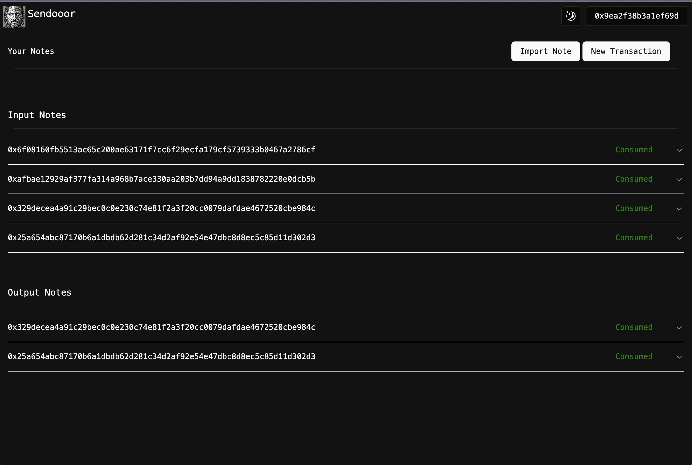

# Miden Sendoor

This is the start of a project that will allow for Miden transactions to be ran from a web interface (currently only rust or CLI options are available).

### Current Capabilities

At the moment, this is only a web app that can be ran on a local environment with the miden CLI configured. In this UI, a user can generate new mint and send transactions, view their notes, and import notes.

The core functionality that was desired for this hackathon was the ability to generate a private note in a browser, and then send this note to a recipient as easily (and securely) as possible. This functionality is currently possible in this UI - but this will need continued development/testing on the Miden Web Client package to get this web app to a version where it does not require a backend and Miden CLI.

### Architecture

This is the current structure of the project:


In time - this architecure will be reduced to just the Next App front end.

### Installation/How to Run

To run this project, you will need to have the Miden CLI installed and configured, as well as a standard npm package manager (npm, pnpm, yarn, bun, whatever). I use bun, so the instructions will be for that.

#### Miden CLI Set Up

Before running this, it is worth reading up on how the CLI works. You can find a bunch of information about that [here](https://docs.polygon.technology/miden/miden-client/cli-reference/#new-wallet).

Once you have the CLI installed, you can run the following commands to set up the CLI:

```
cd miden-cli-local
miden init --rpc 18.203.155.106
```

#### Web App Set Up

```
cd client
bun install

# this step is to populate the .env file with your CLI path
bun run get-cli-path
bun dev

```

and then open to `localhost:3000` in your browser and you should be in business!

### Future Work

This needs to use the Miden WebClient - but it's still got some teething issues. However, I think that this a good start,
and moving to the WebClient will shouldn't be too tricky - we just need to replace the API calls to the:

- account
- claim-note
- generate-note-url
- notes
- send

endpoints with calls to the WebClient.

#### Screenshots

### Sign In Page


##### Home Page



#### Create Note/Transaction


##### Import Note

When using the URL method:


Or drag and drop file:


#### Note Details


